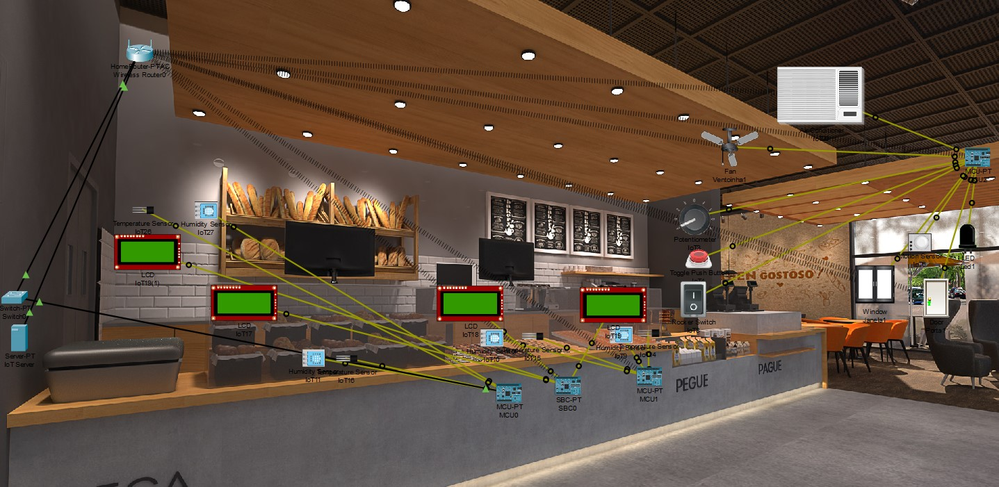
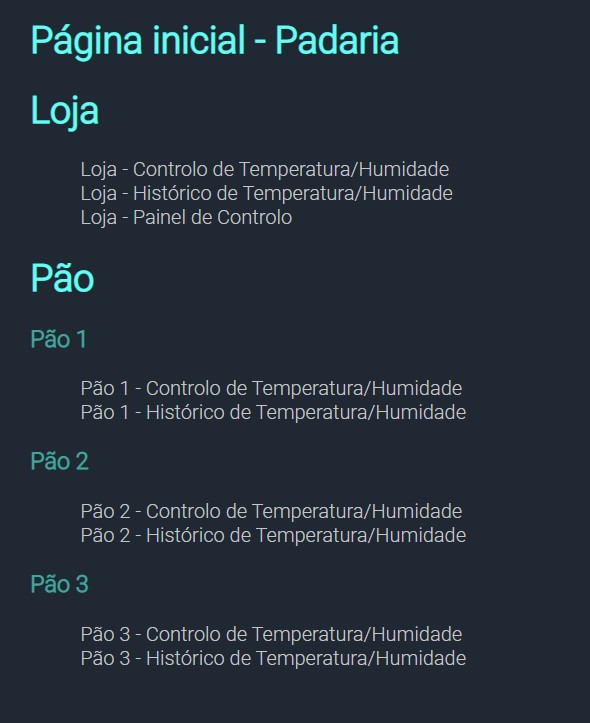
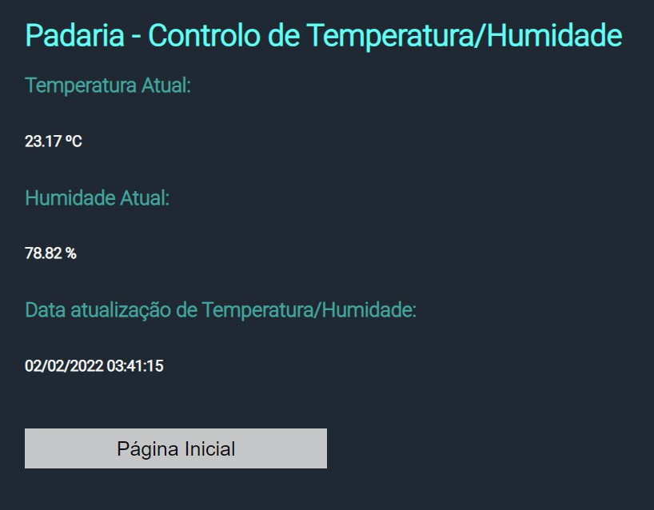
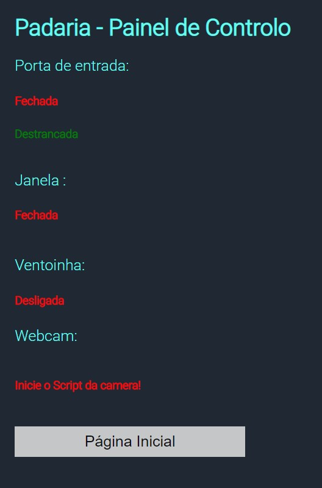

# Project Smart Bakery

#### Description:

> This project consists of a packet tracer application that makes a simple bakery smart using various sensors and features,
> You also have real-time access to the bakery through the website with an API connection where you can close doors and check the temperature.

> Tools used:
>
> - [Packet Tracer](https://www.netacad.com/courses/packet-tracer)
> - [CSS](https://www.w3schools.com/css/)
> - [PHP](https://www.php.net/)
> - [Pyton](https://www.python.org/)

## Development Setup

    git clone https://github.com/JoaoJesus1337/SmartBakery.git

## Packet Tracer System

 

 

## Website Main Page

 

 

## Temperature / Humidity Control Page

 

 

## Bakery Control Page [Door Control/ Window Control / Fan Control]

 

 

# CO-Author

 

[@DiogoLopes](https://github.com/drvlopes)
